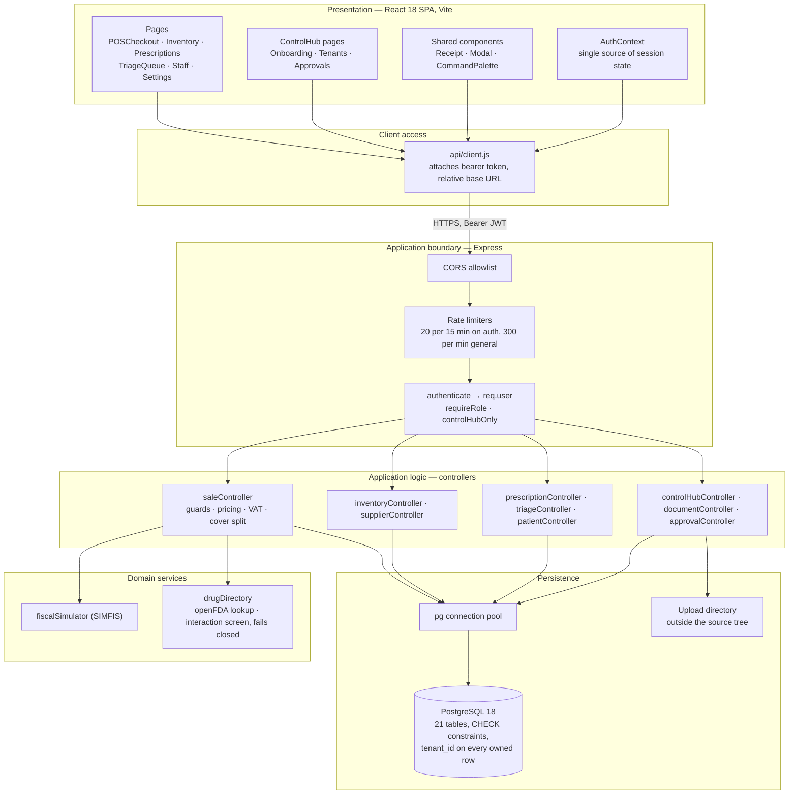
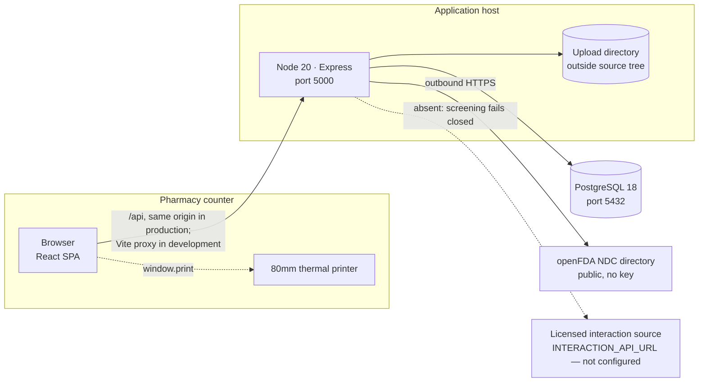

# Architectural Proof of Concept — Pharmacy POS Platform

**Group 16 · CSC4630 Advanced Software Engineering**
Unified Process, Elaboration iteration 1. Architectural analysis and executable
spike, after Larman, *Applying UML and Patterns*, 3rd edition, chapters 13 and
33.

An architectural proof of concept is not a description of the code. It is an
argument that the risky decisions have been settled by building something that
runs, together with an honest statement of what running it did and did not
prove.

Elaboration exists to retire architectural risk. This document names the risks
that shaped the architecture, the decision taken against each, the evidence that
the decision holds, and — in the last section — the three places where the
evidence is weaker than the design claims.

---

## 1. Architectural factors

The factors below are the ones that actually constrained the design. Each is a
quality attribute with a scenario attached, because a factor without a scenario
cannot be tested.

| # | Factor | Scenario it must survive |
| :--- | :--- | :--- |
| **F1** | **Tenant isolation** | Two pharmacies use the platform. A cashier at one requests a product ID belonging to the other. Nothing about the second pharmacy's data may be returned or changed. |
| **F2** | **Transactional integrity of a sale** | A basket of four lines fails its guard on the fourth. No sale, no stock movement and no change to stock on hand may remain. |
| **F3** | **Server-authoritative pricing** | A modified client posts a sale with its own prices and tax figures. The recorded sale must reflect catalogue prices and computed tax. |
| **F4** | **Privilege separation between platform and pharmacy** | A pharmacy administrator attempts to reach platform administration. It must be refused, and no path may exist that promotes them. |
| **F5** | **Regulatory correctness** | VAT treatment, prescription control and expiry rules must be enforced by the system rather than by staff discipline, and must be demonstrable to an inspector. |
| **F6** | **Deployability by a student team on a laptop** | Full stack must start from a clean checkout with two commands and no cloud account. |
| **F7** | **Change without regression** | A guard added late in Construction must not silently break the guards added earlier. |

F1 through F5 are the architecturally significant ones. F6 and F7 are project
constraints, but both shaped real decisions, so they are stated rather than
implied.

---

## 2. Logical architecture

Four layers, and one rule that holds the whole thing together: **`req.user` is
the only source of tenant identity.** It is set by `authenticate` from a signed
token and by nothing else. No controller reads a tenant from the URL, the body
or a header.

That rule was not free. `client/src/api/client.js` originally sent an
`X-Tenant-ID` header naming one pharmacy (DEF-015). The server never read it, so
nothing was broken — but a header that looks authoritative and is not is an
invitation for someone later to start trusting it. It was removed rather than
documented.

---

## 3. Architectural decisions

Each decision is stated with the alternative that was rejected, because a
decision without a rejected alternative is not a decision.

### AD-1 · The transaction boundary is the controller, not a service layer

`saleController.createSale` opens a connection, issues `BEGIN`, runs every guard
and every write, and commits or rolls back. `supplierController.receiveAgainstOrder`
and `approvalController.decide` do the same.

**Alternative rejected:** a service layer owning transactions, with controllers
reduced to translation. That is the more conventional structure and it would
read better. It was rejected because of what the SSDs show: every state-changing
system operation in this system is a single round trip carrying a whole
document. There is no operation that spans two requests, so there is no
transaction that spans two controllers, so a service layer would have added a
level of indirection without taking on a responsibility the controller could not
hold.

**Cost, stated plainly:** business rules live in controllers, which makes them
harder to unit test in isolation. The suite tests them through HTTP with
Supertest instead. That is integration testing, and it is slower and coarser
than unit testing the same rules would be. It is also closer to what a regulator
would ask to see demonstrated, which is why the trade was accepted rather than
merely tolerated.

### AD-2 · Plain SQL through `pg`, no ORM

**Alternative rejected:** Sequelize or Prisma.

Three reasons. The guards in UC-01 are expressed most clearly as the queries
they actually are — `expiry_date < CURRENT_DATE`, `ORDER BY expiry_date ASC`,
`FOR UPDATE`. An ORM would either hide those or require an escape hatch for each
one. Second, `FOR UPDATE` row locking is central to AD-4 and AD-5 and is exactly
the sort of thing ORMs express awkwardly. Third, the schema is a graded
deliverable in its own right: `schema_postgres.sql` is the artefact the marking
guide asks for, and generating it from model classes would invert that.

**Cost:** every query is hand-written and hand-scoped by `tenant_id`. Nothing
enforces that a new query includes the scope. This is the largest standing risk
in the architecture and is addressed in §6.

### AD-3 · Guards run server-side, inside the transaction, before anything is written

The client may validate for the cashier's benefit. Nothing the client validates
is believed.

**Alternative rejected:** database constraints alone. Constraints are good at
"this value is one of these five" and are used for exactly that throughout the
schema. They are poor at "this batch expired relative to today, and here is the
batch number and the date so the pharmacist knows which box to pull off the
shelf". The guard has to produce a message a human can act on, which means it
has to be code.

Both are used where both apply. `approver_differs_from_requester` is a table
constraint *and* a controller check, so the rule survives a controller that
forgets it.

### AD-4 · Pessimistic row locking on contended decisions

`SELECT ... FOR UPDATE` is taken on the approval request before it is decided,
and on the purchase order before a delivery is booked against it.

**Alternative rejected:** optimistic concurrency with a version column, retrying
on conflict. Both operations are rare and short. The contention window is
milliseconds and the consequence of losing the race is applying a platform
action twice or consuming an outstanding balance twice. Pessimistic locking is
the simpler correct answer at this volume; optimistic control would be the right
answer if these were high-frequency operations, and they are not.

### AD-5 · JWT bearer tokens, no server-side session store

A one-hour access token carries `userId`, `tenantId`, `role` and `username`; a
seven-day refresh token renews it.

**Alternative rejected:** server-side sessions. Rejected for F6: sessions want a
store, a store wants Redis, and Redis wants infrastructure the team cannot
assume on a marking laptop.

**Cost, stated plainly:** a token cannot be revoked before it expires.
Deactivating a staff account stops them signing in again but does not invalidate
a token already issued, so the account stays usable for up to an hour. For a
pharmacy with a handful of staff this is an accepted risk; for a larger
deployment it would need a revocation list.

### AD-6 · Simulated fiscalisation is architecturally separate from genuine fiscalisation

`sales.smart_invoice_ref` holds a ZRA Smart Invoice reference issued elsewhere.
SIMFIS writes to four different columns and never touches that one.

This is an architectural decision rather than a coding one, because it is about
where a boundary sits. Smart Invoice has been mandatory for VAT-registered
businesses since 1 July 2024 and must be issued through a certified system. This
project is not an approved provider. The architecture therefore has to make it
*structurally impossible* for a simulated value to end up in the field that a
downstream reader would treat as genuine — not merely unlikely, and not merely
documented. Separate columns do that; a `is_simulated` flag on one column would
not, because a flag can be dropped from a query.

A test asserts that `smart_invoice_ref` is still null after a sale has been
fiscalised by SIMFIS.

### AD-7 · Interaction screening fails closed

With no interaction source configured, `drugDirectory` reports that the basket
**could not be screened**. It does not report that the basket is clear.

The NLM retired its free drug-drug interaction API on 2 January 2024 and the
endpoint now returns 404. The direct port of that call treats 404 as "no
interactions found" (DEF-033). In a pharmacy that means telling a dispenser a
basket is safe when nothing was checked. Fail-closed is an architectural
posture, not a feature: it is the rule that an unavailable safety check must
degrade to *unknown*, never to *fine*.

---

## 4. The executable spike, and what it proves

The proof of concept is the running system, exercised by 234 automated tests
across 20 suites. Each architectural factor is tied below to the test that
demonstrates it, so the claim can be checked rather than believed.

| Factor | Demonstrated by | Suite |
| :--- | :--- | :--- |
| F1 Tenant isolation | A cashier at pharmacy A posts a sale naming a product of pharmacy B; the sale is refused as "product not found" and nothing at B changes. Booking stock against another pharmacy's product is refused. Verifying another pharmacy's prescription returns 404 rather than a false success. | `tenantIsolation`, `prescription` |
| F2 Transactional integrity | A basket whose guard fails leaves no sale row, no stock movement and `quantity_on_hand` unchanged. | `expiryGuard` |
| F3 Server-authoritative pricing | Totals in the response are computed from catalogue prices; a basket mixing zero-rated medicines with standard-rated sundries is taxed only on the sundries. | `sale`, `complianceAndTrade` |
| F4 Privilege separation | A pharmacy `Admin` presenting valid credentials at ControlHub is refused rather than issued a `SuperAdmin` token. A maker cannot approve their own request, and the target is verified unchanged after the refusal. | `auth`, `makerChecker` |
| F5 Regulatory correctness | Prescription-only medicine without a prescription is refused. An expired named batch is refused. Activation is withheld while any of the seven ZAMRA document types is unverified. Simulated fiscal values never occupy the genuine reference field. | `sale`, `expiryGuard`, `complianceAndTrade`, `fiscalSimulation` |
| F6 Deployability | `npm run db:reset` builds the schema and seed from the two SQL files; server and client each start with one command. Same path used by CI. | CI pipeline |
| F7 Change without regression | Every fix carries a test that fails without it, and the whole suite runs on every push and pull request. | CI pipeline |

### The CI pipeline as part of the architecture

`.github/workflows/ci.yml` stands up PostgreSQL 15 as a service container, installs
both workspaces, lints the server, builds the client, applies schema and seed via
`db:reset`, and runs the suite.

It belongs in this document rather than in a tooling appendix because it is what
makes F7 an architectural property instead of an intention. The pipeline also
records a defect of its own: DEF-014, where the test job relied on an un-awaited
`initDb()` firing on module import and was therefore racy against a cold
database. The explicit `db:reset` step is the fix.

---

## 5. Deployment view

Single-host deployment. The client is a static build served alongside the API, so
there is no cross-origin call in production; the CORS allowlist exists for
development, where Vite serves the client on port 3000 and proxies `/api` to
5000.

Uploaded compliance documents are held outside the source tree and are never
served as static content. They are streamed by a controller that first checks
the caller is platform staff, and the stored path is confined to the upload
directory — a stored path is not a licence to read elsewhere on disk.

---

## 6. What this proof of concept does *not* establish

An architectural proof of concept that only reports success has not been read
critically. Three claims in this document are weaker than they look.

**Tenant isolation is enforced by convention, not by the database.** Every query
is scoped by `tenant_id` because every query was written that way, and
`tenantIsolation.test.js` demonstrates the paths it covers. It does not
demonstrate the paths it does not cover, and nothing prevents a new query from
omitting the scope. The structural fix is PostgreSQL row-level security with the
tenant set as a session variable, which would move the guarantee from discipline
to the engine. That is the single highest-value architectural change left, and
it is not done.

**Some controllers fall back to mock responses when PostgreSQL is unreachable**
(LIM-003). `config/db.js` keeps a `dbAvailable` flag and controllers branch on
it. The intent was demo resilience. The effect is that an outage can present as
working software, which is the opposite of what a health check exists to
achieve, and it directly contradicts the fail-closed posture of AD-7. The
fallback should be behind an explicit demo flag, off by default.

**`initDb()` is invoked without being awaited at module load.** The application
therefore begins accepting requests while schema verification may still be in
flight. In practice the first request arrives later than the check completes, and
the CI pipeline no longer depends on it. "In practice" is not an architectural
guarantee, and this should be awaited during startup before the listener binds.

None of the three is hidden in a footnote elsewhere; each is recorded in
`DEFECT_LOG.md` or above, and each has a stated fix. Elaboration is where
architectural risk is meant to be retired, and being explicit about the risk that
has not been retired is part of retiring it.

---

## 7. Summary judgement

The architecture is proven sufficient for the use cases in the Elaboration set.
The five significant factors each have a scenario, a decision and a passing test.
The two structural weaknesses that remain — isolation by convention, and mock
fallbacks masking an outage — are both known, both recorded, and both have a
concrete fix that does not require the architecture to change shape.

The system is buildable, runnable and testable from a clean checkout, which is
the minimum bar an executable proof of concept has to clear, and it enforces its
regulatory rules in code rather than in staff training, which is the bar this
particular domain sets.
