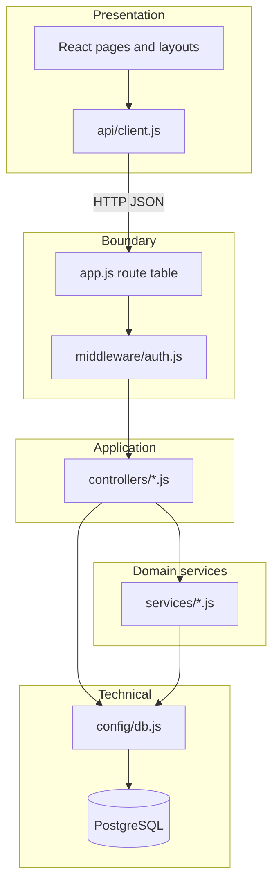
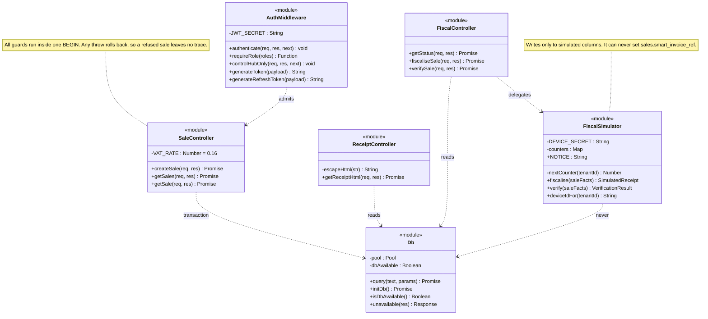
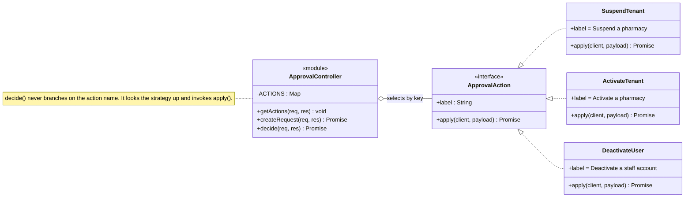
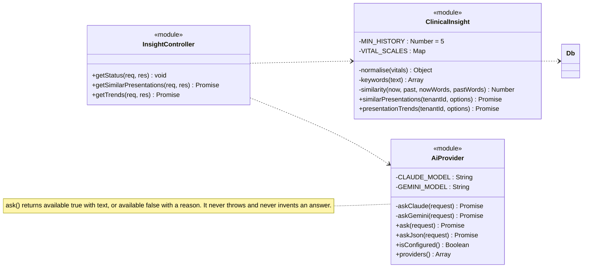
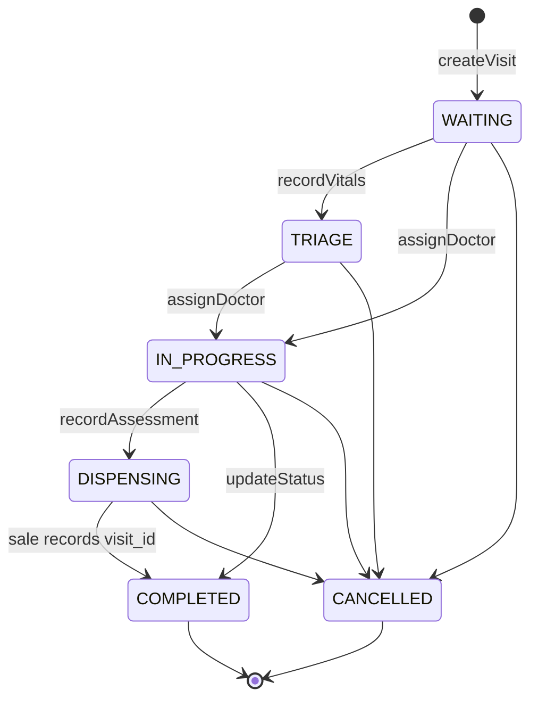
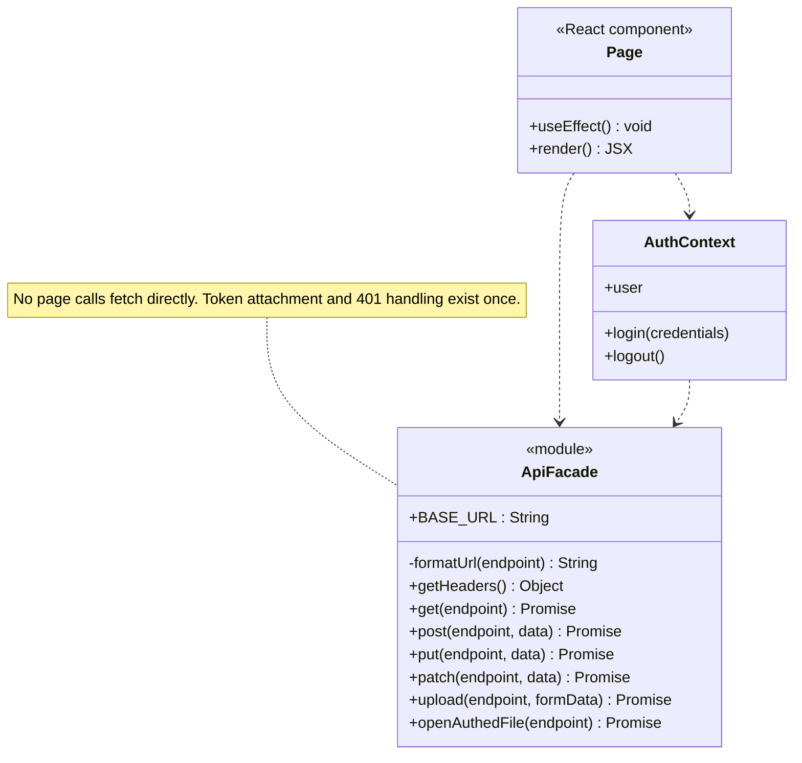

# Design Class Diagrams — Pharmacy POS Platform

**Group 16 · CSC4630 Advanced Software Engineering**
Unified Process, Construction. After Larman, *Applying UML and Patterns*, 3rd
edition, chapters 16, 17 and 26.

---

## 1. What this document is, and how it differs from the domain model

`DomainModel.md` is a **conceptual** model. Its classes are things a pharmacist
would recognise — a Batch, a Prescription, a Visit — and they carry attributes
but no methods, because a conceptual class does not do anything. It is a
vocabulary, not a design.

This document is the **design** model. Its classes are software classes: they
have real signatures, real visibility, real dependencies, and they correspond to
files you can open. Where the domain model says *a Sale is authorised by a
Prescription*, the design model says which module loads that prescription, in
what order it checks it, and what happens to the transaction when the check
fails.

Larman's rule for moving between the two is that the design model is derived
from the domain model plus the operation contracts in
`SystemSequenceDiagrams.md`, and that the derivation is driven by GRASP
responsibility assignment. That is the path followed here.

### A note on notation, honestly stated

This system is written in JavaScript with CommonJS modules, not in a class-based
language. There is no `class SaleController`. What exists is
`server/src/controllers/saleController.js`, a module exporting three functions.

Rather than pretend otherwise, the diagrams below apply a consistent and stated
mapping:

| UML in these diagrams | What it is in the code |
| :--- | :--- |
| Class | A module (one `.js` file) |
| `+ operation` | A binding on `exports` — reachable from another module |
| `- operation` | A `const` declared at module scope and never exported |
| `- attribute` | Module-scope state or constant |
| Dependency arrow | A `require()` of that module, used at runtime |
| `<<constant>>` | A frozen lookup table, not behaviour |

Every signature below was read from the file it names. Where a method's real
signature is `(req, res)` because Express supplies those objects, the diagram
shows `(req, res)` rather than inventing a tidier one, and the parameters that
actually matter are given in the accompanying prose.

---

## 2. Layering

The system has four layers and the dependency direction never reverses: nothing
in a lower layer imports anything from a higher one.



Two observations matter for the marks in section 3 of the guide.

**There is no separate persistence layer.** Controllers issue SQL directly
against `db.pool`. This is a deliberate trade, not an oversight: an ORM was
rejected during Elaboration because the guard logic in `createSale` needs an
explicit transaction boundary and explicit row locks, and hiding those behind a
mapper made the safety properties harder to prove rather than easier. The cost
is that `tenant_id` scoping is a convention every query must remember, which is
recorded as risk R-02/R-10 and is the largest remaining architectural weakness.

**`config/db.js` is a GRASP Pure Fabrication.** It is not a domain concept. It
exists so that exactly one module owns the connection pool, the availability
flag, and the shape of the refusal returned when PostgreSQL cannot be reached.

---

## 3. DCD-01 · Processing a sale

Realises UC-01 and contract CO-01. This is the most safety-critical path in the
system, and the design is arranged so that every reason to refuse a sale is
evaluated **before** any row is written.



### The guard pipeline

`createSale` is one long function, and that is a design decision worth
defending. Splitting it would mean either passing the open `client` handle
through several modules — which spreads knowledge of the transaction boundary —
or committing early. The pipeline is instead kept in one place, in a fixed
order, with a comment at each step naming the defect that step exists to
prevent.

| # | Guard | Reads | Refusal |
| :--- | :--- | :--- | :--- |
| 0 | Prescription belongs to this pharmacy | `prescriptions` | `Prescription not found for this pharmacy` |
| 0a | Prescription status is `VERIFIED` | `prescriptions.status` | `PRESCRIPTION NOT VERIFIED` |
| 0b | Prescription has not lapsed | `prescriptions.valid_until` | `PRESCRIPTION EXPIRED`, naming the date |
| 1 | Product belongs to this pharmacy | `products` | `Product not found` |
| 2 | A prescription was supplied where one is required | `products.requires_prescription` | `PRESCRIPTION REQUIRED` |
| 2a | That prescription actually lists this product | `prescription_items` | `NOT PRESCRIBED` |
| 2b | Quantity does not exceed what was prescribed | `prescription_items.quantity` | `EXCEEDS PRESCRIPTION`, giving both figures |
| 3 | A named batch is this product's, and in date | `product_batches` | `EXPIRED STOCK`, naming batch and date |
| 3′ | With no batch named, some batch is in date | `product_batches` | `EXPIRED STOCK: All batches … expired or out of stock` |
| 4 | Enough in-date stock is held | `product_batches.quantity_on_hand` | `INSUFFICIENT STOCK`, giving both figures |
| 5 | A named visit is this pharmacy's and still open | `visits.status` | `That visit is already closed` |

Steps 0–0b were added as DEF-037: the prescription id had been accepted as
proof in itself, so an unverified prescription, one written a year earlier, or
one listing entirely different medicines all unlocked a controlled sale. Steps
2a–2b were LIM-001. Step 4 previously did not exist and stock went negative.

### Is this Template Method?

Our earlier working notes described the guard sequence as the Gang of Four
**Template Method** pattern. On inspection that claim does not hold and is
withdrawn here rather than repeated.

Template Method requires an inheritance hierarchy: a superclass fixes the
skeleton and subclasses override named hook steps. `createSale` has no
superclass, no subclass and no overridable hook. What it has is a *fixed
algorithm whose steps vary on data* — `requires_prescription`, `vat_treatment`
and whether a product has batch records at all. That is data-driven variation,
which is a different mechanism with different trade-offs.

The accurate description is a **guard pipeline** exhibiting two GRASP
principles: **Protected Variations**, because a new VAT class or a new guard is
absorbed by adding a row to a lookup or a step to the pipeline rather than by
editing pricing arithmetic scattered across the codebase; and **Information
Expert**, because the price, the VAT treatment and the stock position are all
read from the rows that own them and never from the request body.

That last point is the single most important line of the design. `unitPrice`
comes from `products.selling_price`. A client that posts its own price is
ignored.

---

## 4. DCD-02 · Maker-checker approval — Strategy

Realises UC-11 and SSD-04. This one **is** a genuine Gang of Four pattern.



`ACTIONS` is a lookup from an action name to an object carrying a human label
and an `apply(client, payload)` function. `decide` selects one at run time by
key and invokes it without knowing what it does:

```js
if (decision === 'APPROVED') {
  await ACTIONS[request.action].apply(client, request.payload);
}
```

This satisfies Strategy's intent exactly — a family of interchangeable
algorithms, encapsulated, selected at run time, with the client decoupled from
which one runs. JavaScript expresses it with function objects rather than
subclasses, which is the ordinary form of the pattern in a language with
first-class functions.

It also carries a security property that a `switch` statement would not.
`createRequest` refuses any action not present in `ACTIONS`, so the set of
things that can *ever* be enacted through approval is closed and enumerable in
one place. Adding a capability means adding a strategy; it cannot be smuggled in
through a payload.

Three further design points, each asserted by `makerChecker.test.js`:

- The row is selected `FOR UPDATE`, so two approvers cannot both decide the same request and apply the action twice.
- A request that is not `PENDING` is refused with 409 rather than re-applied.
- **The requester can never be the approver.** This is the rule the whole mechanism exists for, and it is checked after the lock and before the strategy runs.

---

## 5. DCD-03 · Language model access — Chain of Responsibility



`ask` tries Claude, and on any failure logs it and tries Gemini. If neither is
configured, or both fail, it returns `{ available: false, reason }`. Each
handler either handles the request or passes it along, and the chain has an
explicit terminal case — which is Chain of Responsibility's structure. The
chain is fixed at two links rather than composed at run time, so this is the
pattern's intent realised in its simplest form, not a full handler list.

The property that matters clinically is the terminal case. A caller receiving
`available: false` must say the question could not be answered. It must not
substitute a guess. This is the same rule the drug interaction check follows,
and for the same reason: in a dispensing context, silence that looks like an
answer is more dangerous than an outage.

`askJson` extends this — a reply that does not parse as JSON is treated as *no
answer* rather than being passed along half-understood.

Note also what `ClinicalInsight` does **not** do. `similarPresentations` refuses
to generalise from fewer than `MIN_HISTORY` (5) records, and
`presentationTrends` is deliberately plain arithmetic over counts. Neither is
presented as a diagnosis.

---

## 6. DCD-04 · The triage workflow — a table-driven state machine



The legal moves live in one exported constant, not scattered across handlers:

```js
const ALLOWED_TRANSITIONS = {
  WAITING:     ['TRIAGE', 'IN_PROGRESS', 'CANCELLED'],
  TRIAGE:      ['IN_PROGRESS', 'CANCELLED'],
  IN_PROGRESS: ['DISPENSING', 'COMPLETED', 'CANCELLED'],
  DISPENSING:  ['COMPLETED', 'CANCELLED'],
  COMPLETED:   [],
  CANCELLED:   []
};
```

`COMPLETED` and `CANCELLED` map to empty arrays, so a closed visit cannot
reopen — the guarantee is structural rather than a forgotten `if`. Exporting
the table lets `triageWorkflow.test.js` assert against the same object the
controller uses, so the test cannot drift from the implementation.

**This is not the GoF State pattern.** State replaces conditional logic with
polymorphic state objects, each knowing its own transitions. Here the machine is
a plain lookup table. That is the right choice at this size: six states with no
per-state behaviour beyond permission would gain nothing from six classes. It is
named accurately so a reader is not told to look for a hierarchy that does not
exist.

What replaced the old design is worth recording. The queue was previously a
board of hand-set labels: any signed-in user could set any status, `TRIAGE` was
never set by anything at all, and there was no state between the consulting room
and the till. Vitals now advance a visit to `TRIAGE` as a side effect of the
work actually being done, and `sales.visit_id` closes the walk-in-to-till loop.

---

## 7. DCD-05 · The client-side Facade



A textbook **Facade**: one simplified interface over a messier subsystem
(`fetch`, header assembly, bearer tokens, JSON parsing, blob handling). No page
component calls `fetch` directly, so three cross-cutting concerns are
implemented exactly once —

- the bearer token is read from `localStorage` and attached on every call;
- a `401` clears the stored token wherever it happens;
- `upload` deliberately **omits** `Content-Type` so the browser can set the multipart boundary itself, and `openAuthedFile` fetches bytes as a blob because a plain `<a href>` cannot carry a bearer token.

Those last two are the kind of detail that, left to individual pages, gets right
in one place and wrong in four.

The tenant is deliberately **not** a header. It is carried inside the signed
token, so a client cannot assert which pharmacy it belongs to.

---

## 8. GRASP responsibility assignment

| Responsibility | Assigned to | GRASP pattern | Why |
| :--- | :--- | :--- | :--- |
| Handle a system operation | The controller module named in `app.js` | **Controller** | One façade object per use-case group, not per screen |
| Price a sale line | `saleController`, reading `products` | **Information Expert** | The row that owns the price sets the price |
| Decide VAT on a line | `products.vat_treatment` | **Information Expert** | VAT is a property of the product, not of the basket |
| Create a `SaleItem` | `saleController`, inside the sale's transaction | **Creator** | The Sale aggregates the items and holds the data to initialise them |
| Own the connection pool | `config/db.js` | **Pure Fabrication** | Not a domain concept; exists to keep the design clean |
| Enact an approved change | The `ACTIONS` strategy | **Polymorphism** | Behaviour varies by type; select, do not branch |
| Answer when no model can | `aiProvider.ask` | **Indirection** | Controllers never learn which provider failed |
| Absorb a new VAT class or guard | Lookup tables and the pipeline | **Protected Variations** | The variation point is data, not scattered conditionals |
| Refuse when the database is down | `db.unavailable` | **Pure Fabrication** | One refusal shape, so no controller improvises |

---

## 9. Gang of Four patterns actually present

Stated conservatively. A pattern is listed only where the intent *and* a
recognisable mechanism are both present.

| Pattern | Where | Confidence |
| :--- | :--- | :--- |
| **Strategy** | `ACTIONS` in `approvalController.js` | **Certain.** Interchangeable encapsulated algorithms selected by key at run time |
| **Facade** | `client/src/api/client.js` | **Certain.** One interface over fetch, auth and parsing |
| **Chain of Responsibility** | `ask()` in `aiProvider.js` | **Strong.** Try, pass along, explicit terminal case — with a fixed two-link chain |
| **Singleton** | The `pg.Pool` in `config/db.js` | **Structural.** One instance per process by module caching, not by a `getInstance` guard |
| **Adapter** | `drugDirectory.js` over openFDA and RxNav | **Reasonable.** Foreign JSON is normalised to our shape, including severity |
| **Factory (closure)** | `requireRole(...roles)` | **Partial.** A function returning a configured middleware; a higher-order function, not GoF Abstract Factory |

### Claimed elsewhere, and withdrawn here

- **Template Method** for the `createSale` guard sequence — no hierarchy, no overridable hook. See §3.
- **State** for the triage workflow — a lookup table, not polymorphic state objects. See §6.
- **Observer** — the UI polls; nothing subscribes. There are no websockets and no event bus.

Naming a pattern that is not there would cost more than it gains. A marker who
opens `saleController.js` looking for a superclass will not find one.

---

## 10. Coupling, cohesion, and what we would change

**Cohesion is good at the module level.** Each controller serves one use-case
group; each service does one thing. The exception is `saleController.createSale`
at roughly 300 lines, defended in §3 but genuinely at the limit of what one
function should hold.

**Coupling is low between layers and high to the database.** Every controller
knows SQL. This was the deliberate trade recorded in
`ArchitectureProofOfConcept.md`, and it is the source of the main residual risk:
tenant isolation is enforced because every query was *written* with
`tenant_id = $n`, and nothing structural stops the next one omitting it.

**The fix we would make next** is PostgreSQL row-level security, so isolation
becomes a property the database enforces rather than a habit the team keeps.
`tenantIsolation.test.js` currently guards this behaviourally, which catches
regressions in tested paths but proves nothing about an untested new query.
This is R-02/R-10 in `RiskList.md` and it is open.

---

## 11. Traceability

| Use case | SSD | Contract | Design class diagram | Implementation | Tests |
| :--- | :--- | :--- | :--- | :--- | :--- |
| UC-01 Process Sale | SSD-01 | CO-01, CO-02 | DCD-01 | `saleController.createSale` | `sale.test.js`, `expiryGuard.test.js`, `complianceAndTrade.test.js` |
| UC-02 Sign In | SSD-02 | CO-03, CO-04 | DCD-01 (`AuthMiddleware`) | `authController.login` | `auth.test.js` |
| UC-04 Receive Stock | SSD-05 | CO-09, CO-10 | DCD-01 (`Db`) | `supplierController.receiveAgainstOrder` | `inventory.test.js` |
| UC-09 Triage a Visit | — | — | DCD-04 | `triageController` | `triageWorkflow.test.js` |
| UC-11 Approve a Change | SSD-04 | CO-07, CO-08 | DCD-02 | `approvalController.decide` | `makerChecker.test.js` |
| Clinical insight | — | — | DCD-03 | `insightController`, `clinicalInsight` | `clinicalInsight.test.js` |
| Fiscalisation (simulated) | — | — | DCD-01 (`FiscalSimulator`) | `fiscalController`, `fiscalSimulator` | `fiscalSimulation.test.js` |
