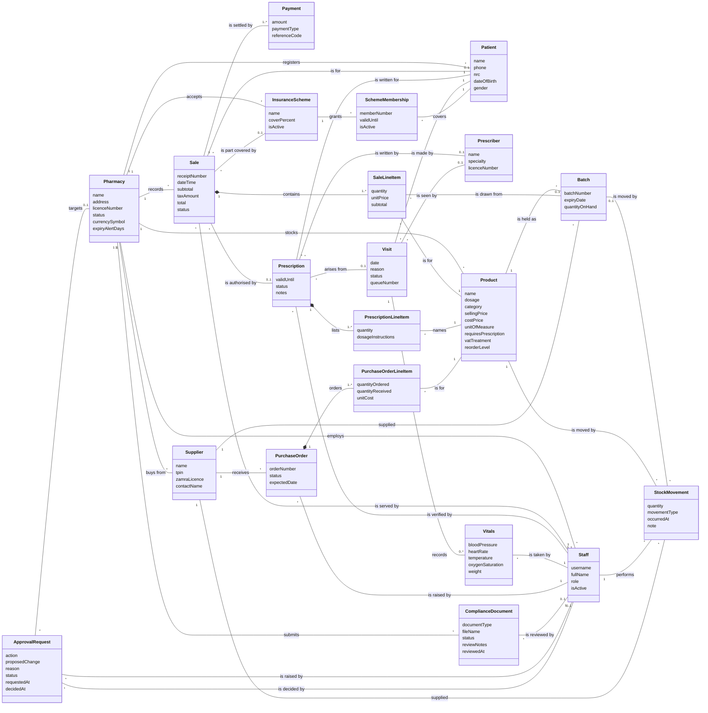

# Domain Model — Pharmacy POS Platform

**Group 16 · CSC4630 Advanced Software Engineering**
Unified Process, Elaboration iteration 1. Conceptual class diagram after Larman,
*Applying UML and Patterns*, 3rd edition, chapter 9.

A domain model is a visual dictionary of the vocabulary the business already
uses. It holds conceptual classes, their attributes and the associations between
them. It holds no methods, no foreign keys and no software responsibilities:
those belong to the design class diagram, which is a separate document.

This model supersedes `POS domain model.pdf`, the model drawn during Inception.
The final section explains what changed and why, because most of the changes
were forced by something the team learned rather than chosen for neatness.

---

## The model

---

## The conceptual classes, and why each is one

A conceptual class earns its place by being something the pharmacy talks about,
not by being convenient to store. The four below are the ones where that
judgement was not obvious.

### Product and Batch are different things

A `Product` is *what Amoxicillin 500mg is* — a name, a dose, a price, whether it
needs a prescription, how it is taxed. A `Batch` is *a particular consignment of
it* — this box, with this batch number, expiring on this date, with this many
left in it.

The Inception model put `expiryDate` on the product. That is the single most
consequential error in the original diagram. A product does not expire; a batch
does. With expiry on the product there is nowhere to record that the pharmacy
holds two consignments of the same medicine expiring three months apart, so
first-expired-first-out cannot be expressed, a recall cannot be scoped to the
affected consignment, and the expiry guard in UC-01 has nothing to check
against. Separating them is what makes UC-01 extensions 8c and 8d describable at
all.

### StockMovement is a class, not an update

The obvious model of stock is a number on the product that goes up and down.
That number answers "how many are there" and no other question. It cannot answer
"where did those forty tablets go", "who dispensed them", "which delivery did
they arrive on", or "why does the shelf disagree with the system".

`StockMovement` is a ledger entry: a signed quantity, a type, a person, a time,
and the document it belongs to. `Batch.quantityOnHand` is then a running figure
that the ledger explains. When a batch is recalled, the movements name the
supplier and every sale it went into. Regulators ask that question; a bare
counter cannot answer it.

### SaleLineItem holds its own unitPrice

A line item's price looks derivable from its product, and while the sale is
being rung up it is. Once the sale is recorded it is not: the catalogue price
will change, and the receipt must keep saying what was actually charged. The
attribute is not redundant, it is historical.

`subtotal` is genuinely derived (`quantity × unitPrice`) and is marked as stored
in the design model only because a receipt reprinted years later should not
depend on arithmetic being reproduced identically.

### SchemeMembership is a class, not an attribute of Patient

A patient may be a member of a scheme, with their own member number, valid until
their own date. That is an association carrying data of its own, which is what
an association class is for. Putting `schemeId` on `Patient` loses the member
number and the expiry, and both are exactly what a scheme asks for when it
disputes a claim.

---

## Attributes deliberately left off

| Not modelled | Why |
| :--- | :--- |
| Password | Not a domain concept. It is a mechanism for establishing that a `Staff` member is who they say they are, and it lives in the design model. The Inception diagram showed `password` on `User`; a conceptual model should not contain a credential. |
| Foreign keys and IDs | Larman's rule: associations express relationships in a conceptual model. `Sale` relates to `Staff` because a person served it, not because it carries a `user_id`. |
| Totals on `Pharmacy` | Takings, stock value and alert counts are all derived. Derived figures are reports, not domain attributes. |
| `ProductCatalog` | The Inception model had one. In a single-pharmacy till it is a real concept — the list of things this shop sells. Here `Pharmacy "1" -- "*" Product` says the same thing without an extra class whose only content is a list. |
| `Inventory` | Also from the Inception model, carrying `productID`, `quantityInStock` and `reorderLevel`. `reorderLevel` is a property of the product; `quantityInStock` is derived from batches. The class held nothing of its own. |

---

## What changed since the Inception model, and why

The Inception model in `POS domain model.pdf` describes a single-pharmacy till,
which is what the project was then. Six things changed.

**Pharmacy became a class, and almost everything associates with it.** The
system is multi-tenant. Two pharmacies on the platform each have staff, patients,
products and sales, and none of it is shared. In the conceptual model this is a
plain composition. In the design it is the property the whole security posture
rests on — see DEF-004 and `tenantIsolation.test.js`.

**Expiry moved from Product to Batch**, for the reasons above.

**StockMovement was added**, replacing an `Inventory` class holding a single
count.

**Supplier, PurchaseOrder and its line items were added.** DEF-031: stock
arrived with no record of where it came from, so a recalled batch could not be
traced back to whoever supplied it. `Supplier` is not an administrative
convenience; it is the association a recall follows.

**InsuranceScheme and SchemeMembership were added.** The Inception model listed
`insurance` as a payment type with nothing behind it (DEF-032). A payment type
is not a payer. A scheme covers a declared share of a bill and the patient owes
the rest, and that split has to be recorded on the sale.

**ComplianceDocument and ApprovalRequest were added.** Neither belongs to a
pharmacy's daily work, which is why they were not in the Inception model. Both
belong to the platform that admits pharmacies to the system, and the platform
turned out to be half the software.

### The one class from the Inception model that is still missing

The Inception diagram has `Register (POS Terminal)`, associated with `Sale`.
Nothing in the system implements it. That is not an oversight in the diagram; it
is a gap in the software, recorded as **LIM-004**.

Larman's NextGen POS puts `Register` in the model for a reason: it is the thing a
sale happens *at*, and therefore the thing a day's takings are reconciled
*against*. Without it, this system can tell you that a sale belongs to a cashier
but not that it belongs to a shift, so there is no float, no closing count and
no cash variance. Every sale is individually auditable and the day as a whole is
not.

The class this needs is `TillSession` — opened with a declared float, closed with
a counted figure, with every `Sale` associated to exactly one. It is the largest
single piece of domain still to model, and it is the first thing the next
iteration should add.

---

## From domain model to schema

The domain model is not the schema, and the differences are decisions rather
than drift. The four that matter:

| Domain | Schema | Reason |
| :--- | :--- | :--- |
| `Pharmacy` | `tenants` | The word in the code is the architectural one. The domain word is on the screens the pharmacist sees, which is where it belongs. |
| `Staff`, `Prescriber` | `users`, `doctors` | `Prescriber` is modelled separately from `Staff` because a prescription may name a doctor who does not work at the pharmacy and has no account. |
| `Patient` | `customers` | A person buying paracetamol is a customer; a person on a chronic prescription is a patient. The domain calls them patients because the clinical case is the one with rules attached. The table name is historical and is the older of the two. |
| `Sale` covered amount | `scheme_covered`, `patient_payable` on `sales` | The split is an attribute of the sale, not of the association to the scheme, because it is fixed at the moment of sale and does not change when the scheme's cover percent later does. |

The full mapping is `Docs/Elaboration/schema_postgres.sql`, and the design
classes that operate on it are in `DesignClassDiagrams.md`.
