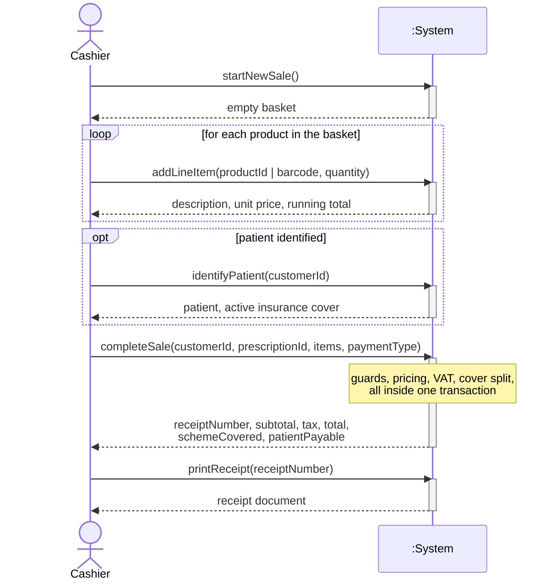
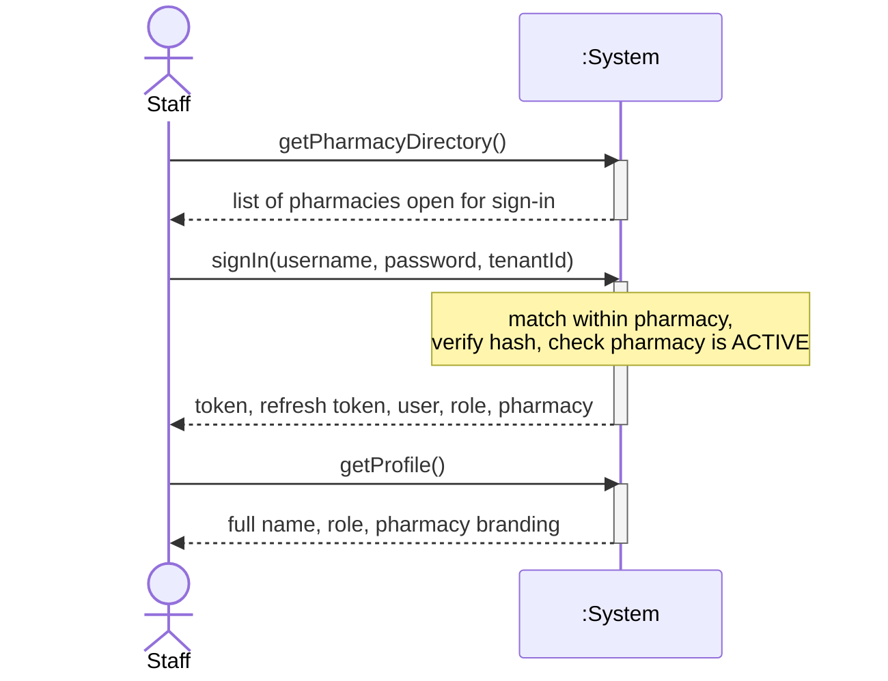
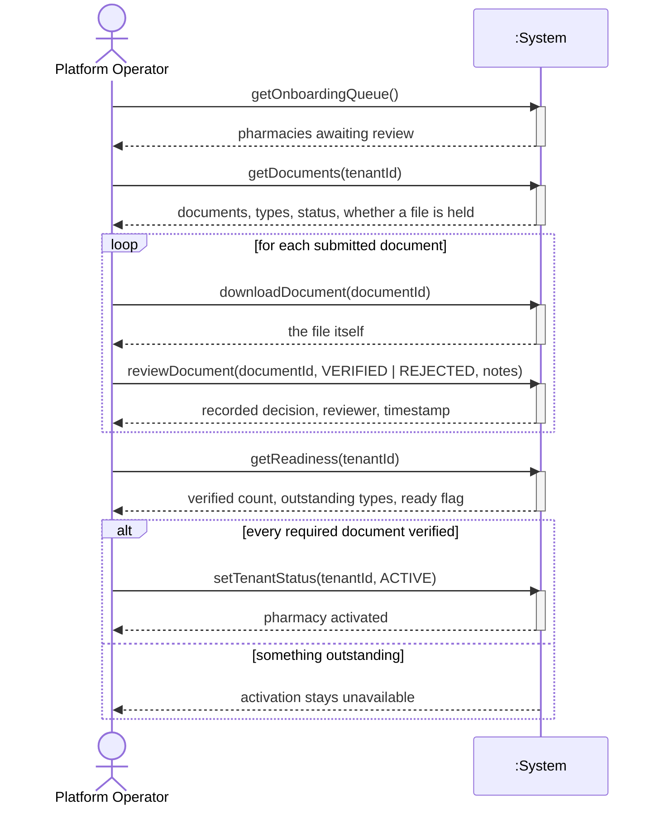
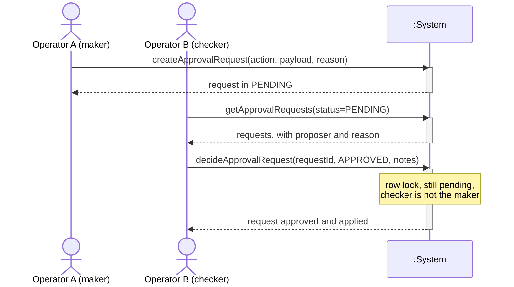
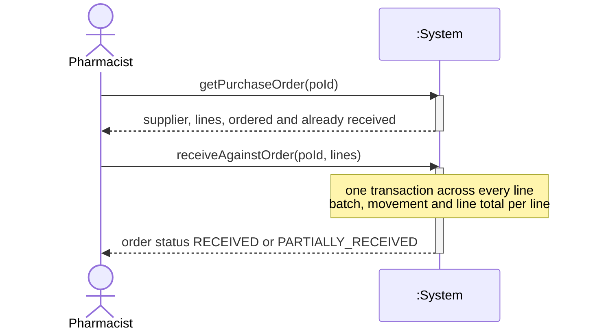

# System Sequence Diagrams — Pharmacy POS Platform

**Group 16 · CSC4630 Advanced Software Engineering**
Unified Process, Elaboration iteration 1. After Larman, *Applying UML and
Patterns*, 3rd edition, chapters 10 and 11.

An SSD treats the system as a single black box. It shows the events an actor
generates against that box, in the order the main success scenario generates
them, and the information the box returns. It says nothing about what is inside.
The internals appear later, in the design class diagrams.

Each diagram below corresponds to one fully-dressed use case in
`UseCases-FullyDressed.md`, and each system operation is followed by its
contract: what must hold before the operation, and what has changed afterwards.
Where a postcondition is asserted by an automated test, the test file is named.

The HTTP route implementing each operation is given so the diagram can be
checked against the running system rather than taken on trust.

---

## SSD-01 · Process Sale

Use case UC-01. Primary actor: Cashier.

Only `completeSale` and `printReceipt` cross the system boundary as state-changing
or persistent operations. `startNewSale` and `addLineItem` are answered from the
catalogue the client already holds; the basket is not persisted until checkout.
That is a deliberate design decision and it has a consequence worth stating: an
abandoned basket leaves no trace, and a basket cannot be resumed on another
terminal.

### Contract CO-01: completeSale

`POST /api/sales` — `saleController.createSale`

| | |
| :--- | :--- |
| **Operation** | `completeSale(customerId, prescriptionId, items, paymentType, smartInvoiceRef)` |
| **Cross reference** | UC-01 Process Sale |

**Preconditions**

- The caller holds a valid token naming a user, a role and an active pharmacy.
- Every `productId` in `items` belongs to that pharmacy.
- Every quantity is a positive integer.

**Postconditions**

- A `Sale` instance was created *(`sale.test.js`)*.
- `Sale` was associated with the `User` who served, and with a `Customer` and a `Prescription` where supplied.
- A `SaleItem` was created for each line and associated with the `Sale`, the `Product`, and the `ProductBatch` drawn from.
- `SaleItem.unitPrice` was set from `Product.sellingPrice`, never from the request body.
- `Sale.taxAmount` was set to the sum of standard-rated line subtotals × 0.16; zero-rated and exempt lines contributed nothing *(`complianceAndTrade.test.js`)*.
- `Sale.schemeCovered` was set to the total × the cover percent of the patient's active membership, and `Sale.patientPayable` to the remainder; both are zero when there is no active cover *(`complianceAndTrade.test.js`)*.
- `ProductBatch.quantityOnHand` was decremented by the quantity dispensed for each line drawing on a batch.
- A `StockMovement` of type `DISPENSE` was created per line, with a negative quantity, associated with the `Sale`.
- A `Payment` was created and associated with the `Sale`.
- Where a `Prescription` was supplied, its status became `DISPENSED`.
- `Sale.receiptNumber` was set to a value unique within the pharmacy.

**Postconditions on rejection** — none of the above. A guard failure rolls the
transaction back, so a refused sale leaves no `Sale`, no `StockMovement` and no
change to any `quantityOnHand` *(`expiryGuard.test.js`)*.

**Guards, in the order they run**

| # | Guard | Failure |
| :--- | :--- | :--- |
| 1 | Product belongs to the caller's pharmacy | `Product not found` *(`tenantIsolation.test.js`)* |
| 2 | Prescription supplied when `requiresPrescription` | `PRESCRIPTION REQUIRED` *(`sale.test.js`)* |
| 3 | Named batch is in date | `EXPIRED STOCK`, naming batch and expiry date *(`expiryGuard.test.js`)* |
| 3′ | No batch named: some tracked batch is in date | `EXPIRED STOCK: all batches expired or out of stock` *(`expiryGuard.test.js`)* |
| 4 | Quantity held ≥ quantity requested | `INSUFFICIENT STOCK`, stating both figures *(`expiryGuard.test.js`)* |

### Contract CO-02: printReceipt

`GET /api/receipts/:receiptNumber/html` — `receiptController.getReceiptHtml`

**Preconditions** — a `Sale` with that receipt number exists in the caller's pharmacy.

**Postconditions** — none. This is a query; it changes nothing. It is listed
because it is the step the cashier and the patient both regard as the end of the
use case, and leaving it out would make the SSD disagree with what happens at
the counter.

---

## SSD-02 · Sign In

Use case UC-02. Primary actor: any staff member.

`getPharmacyDirectory` is the only unauthenticated read in the system that
returns pharmacy names. It exists because of DEF-007: usernames are unique per
pharmacy, not platform-wide, so the staff member has to be able to say which
pharmacy they belong to before they can be found.

### Contract CO-03: signIn

`POST /api/auth/login` — `authController.login`

**Preconditions** — none. This is the operation that establishes identity, so it
cannot assume any.

**Postconditions**

- A signed token was issued carrying `userId`, `tenantId`, `role` and `username`, valid for one hour, and a refresh token valid for seven days.
- No `Sale`, `User` or other domain object changed. Sign-in has no domain side effect; it produces a credential.

**Refused when**

| Condition | Response | Test |
| :--- | :--- | :--- |
| Username matches accounts in more than one pharmacy and no `tenantId` was given | 400, asking for the pharmacy | `auth.test.js` |
| No such account, or the password does not match the stored bcrypt hash | 401, without saying which was wrong | `auth.test.js` |
| The pharmacy's status is not `ACTIVE` | 403, explaining sign-in opens on approval | `onboarding.test.js` |

### Contract CO-04: signInToControlHub

`POST /api/controlhub/login` — `authController.controlHubLogin`

**Preconditions** — none.

**Postconditions**

- A token carrying `role: 'SuperAdmin'` was issued **only if** the stored account already holds that role.
- A pharmacy `Admin` was not promoted. *(`auth.test.js`)*

This second contract exists as a separate operation rather than a parameter of
the first because of DEF-006. When ControlHub sign-in fell through to the
ordinary staff lookup, any pharmacy administrator could obtain a platform-wide
token. Two operations with two different lookups makes the escalation path
impossible to reintroduce by accident.

---

## SSD-03 · Review Onboarding Application

Use case UC-03. Primary actor: Platform Operator.

`downloadDocument` is inside the loop, not beside it. That placement is the
point of DEF-030: documents were metadata only, and paperwork was being approved
that nobody could open. Reading the document *is* the review, so the operation
that fetches it belongs in the main scenario.

### Contract CO-05: reviewDocument

`PATCH /api/controlhub/documents/:documentId/review` — `documentController.reviewDocument`

**Preconditions** — the caller holds a `SuperAdmin` token. The document exists.

**Postconditions**

- `OnboardingDocument.status` became `VERIFIED` or `REJECTED`.
- The document was associated with the reviewing `User` and stamped with the decision time.
- `reviewNotes` was set where supplied.

### Contract CO-06: getReadiness

`GET /api/controlhub/tenants/:id/readiness` — `documentController.getReadiness`

**Preconditions** — the caller holds a `SuperAdmin` token.

**Postconditions** — none; it is a query. Its answer is what gates activation:
`ready` is true only when all seven required document types are present and
verified, and false while any is missing, pending or rejected
*(`complianceAndTrade.test.js`)*.

### Contract CO-07: setTenantStatus

`PUT /api/controlhub/tenants/:id/status` — `controlHubController.updateTenantStatus`

**Preconditions** — the caller holds a `SuperAdmin` token.

**Postconditions**

- `Tenant.status` changed to the requested value.
- Staff of that pharmacy can sign in if and only if the new status is `ACTIVE`.

---

## SSD-04 · Decide Approval Request

Use case UC-04. Primary actor: Platform Operator acting as checker. There is a
second, earlier actor — the maker — whose request is a precondition of this use
case, so both appear.

### Contract CO-08: createApprovalRequest

`POST /api/controlhub/approvals` — `approvalController.createRequest`

**Preconditions** — the caller holds a `SuperAdmin` token.

**Postconditions**

- An `ApprovalRequest` was created in `PENDING`, associated with the requesting `User`.
- The proposed change was recorded as a payload; nothing was applied.

**Refused when** the action is not one the server knows how to carry out. The
allowed set is closed — `SUSPEND_TENANT`, `ACTIVATE_TENANT`, `DEACTIVATE_USER` —
so an approval cannot be raised for something that would then be executed
without a defined effect.

### Contract CO-09: decideApprovalRequest

`PATCH /api/controlhub/approvals/:id/decide` — `approvalController.decide`

**Preconditions** — the caller holds a `SuperAdmin` token. The request exists.

**Postconditions**

- `ApprovalRequest.status` became `APPROVED` or `REJECTED`.
- The request was associated with the deciding `User` and stamped with the decision time.
- On `APPROVED` only, the proposed change was applied to its target within the same transaction.
- On `REJECTED`, no target changed.

**Refused when**

| Condition | Response | Test |
| :--- | :--- | :--- |
| The decider is the requester | 403; the target is left untouched | `makerChecker.test.js` |
| The request is no longer `PENDING` | 409, naming the existing outcome | `makerChecker.test.js` |

The row is locked `FOR UPDATE` for the length of the transaction, so two
checkers deciding at once cannot both apply the change. The separation is
additionally held by a table constraint, `approver_differs_from_requester`, so
the rule survives a controller that forgets it.

---

## SSD-05 · Receive Stock Against Purchase Order

Use case UC-05. Primary actor: Pharmacist.

The whole delivery is one system operation, not one per line. A delivery
half-booked is worse than a delivery not booked: the shelf and the record
disagree and nobody knows by how much.

### Contract CO-10: receiveAgainstOrder

`POST /api/purchase-orders/:id/receive` — `supplierController.receiveAgainstOrder`

**Preconditions**

- The caller holds an `Admin` or `Pharmacist` token.
- The purchase order belongs to the caller's pharmacy and is not `CANCELLED`.
- Each line names a `PurchaseOrderItem` on that order.

**Postconditions**

- A `ProductBatch` was created per line, with the batch number and expiry date given, `quantityOnHand` set to the quantity received, and associated with the `Supplier` on the order *(`complianceAndTrade.test.js`)*.
- A `StockMovement` of type `RECEIVE` was created per line, with a positive quantity, associated with the same `Supplier` and referencing the order.
- `PurchaseOrderItem.quantityReceived` was increased by the quantity received.
- `PurchaseOrder.status` became `RECEIVED` when no line has an outstanding balance, and `PARTIALLY_RECEIVED` otherwise.

**Refused when** a line receives more than is outstanding on it, stating how
many remain *(`complianceAndTrade.test.js`)*. The order row is held
`FOR UPDATE`, so two deliveries booked at once cannot both consume the same
outstanding balance.

---

## What the SSDs make visible

Reading the five together, three properties of the system show up that no single
use case states.

**Every state-changing operation is a single round trip.** There is no operation
that leaves the system in a half-finished state waiting for a second call to
complete it. `completeSale` and `receiveAgainstOrder` each carry a whole
multi-line document. This is why the transaction boundary can sit exactly at the
controller, which is what the architecture document argues.

**The actor never supplies a price, a tax figure, or a stock level.** The
parameters going into the box are identities and quantities. Every money figure
comes back out. A client that lies can only lie about what it wants, not about
what it costs.

**The two ControlHub diagrams have a second actor or a second operator.** SSD-03
requires the operator to read the document before deciding, and SSD-04 requires
two different people. Both are structural, not procedural — the system will not
proceed without them, so the diagram cannot be drawn any other way.

## Traceability

| SSD | Use case | Contracts | Implementation |
| :--- | :--- | :--- | :--- |
| SSD-01 | UC-01 Process Sale | CO-01, CO-02 | `saleController`, `receiptController` |
| SSD-02 | UC-02 Sign In | CO-03, CO-04 | `authController` |
| SSD-03 | UC-03 Review Onboarding | CO-05, CO-06, CO-07 | `documentController`, `controlHubController` |
| SSD-04 | UC-04 Decide Approval | CO-08, CO-09 | `approvalController` |
| SSD-05 | UC-05 Receive Stock | CO-10 | `supplierController` |
