# High-Level Use Cases — Pharmacy POS Platform

**Group 16 · CSC4630 Advanced Software Engineering**
Unified Process, Inception phase. Brief format after Larman, *Applying UML and
Patterns*, 3rd edition.

This document supersedes `HIGH LEVEL USE CASES-POS PHARMACY SYSTEM.docx`, which
described a single-pharmacy till. The system built is a multi-tenant platform:
several pharmacies trade on it, and a platform operator admits and supervises
them. That difference introduces a whole tier of use cases the original document
does not contain.

---

## 1. Actors

### Primary actors

| Actor | Description |
| :--- | :--- |
| **Cashier** | Operates the till. Rings up sales, registers walk-in patients. |
| **Pharmacist** | Dispenses, verifies prescriptions, manages stock and suppliers. |
| **Doctor** | Consults patients from the triage queue and writes prescriptions. |
| **Pharmacy Administrator** | Runs one pharmacy: staff, roles, branding, suppliers. |
| **Platform Operator** (SuperAdmin) | Runs the platform through ControlHub: admits pharmacies, reviews compliance documents, sets operational limits, decides approval requests. |
| **Prospective Pharmacy Owner** | Not yet a user. Applies to join the platform from the public site. |

### Supporting actors

| Actor | Description |
| :--- | :--- |
| **Patient / Customer** | Receives medicine and the receipt. Mostly off-stage. |
| **Supplier** | Wholesaler who fulfils purchase orders. Off-stage. |
| **Insurance Scheme** | Covers an agreed share of a member's bill. Off-stage. |
| **Drug Directory** (openFDA) | External reference service for medicine details. |
| **ZRA Smart Invoice** | External fiscal system. Referenced only; see UC-30. |

---

## 2. Use case diagram

All actors and all thirty-one use cases in one view. The shaded box is the system
boundary: everything inside it is behaviour this platform provides, everything
outside it is an actor. Primary actors sit along the top — they initiate.
Supporting actors sit along the bottom — they are consulted or notified, and
never start anything.

Mermaid has no native UML use case notation, so there are no stick figures and no
ellipses: actors are rectangles, use cases are stadium shapes, and the `«include»`
and `«extend»` stereotypes are drawn as labelled dashed arrows. The relationships
are the UML ones; only the glyphs differ.

```mermaid
flowchart TB
    classDef actor fill:#dce7f3,stroke:#2f4a63,color:#14202b
    classDef support fill:#efe9dc,stroke:#6f6141,color:#231e12
    classDef uc fill:#ffffff,stroke:#55697d,color:#14202b

    OWNER["Prospective<br/>Pharmacy Owner"]:::actor
    OPERATOR["Platform Operator<br/>SuperAdmin"]:::actor
    CASHIER["Cashier"]:::actor
    PHARMACIST["Pharmacist"]:::actor
    DOCTOR["Doctor"]:::actor
    PADMIN["Pharmacy<br/>Administrator"]:::actor
    STAFF["Any Staff Member"]:::actor

    subgraph SYS["Pharmacy POS Platform"]
        direction TB

        subgraph PLAT["Platform administration - ControlHub"]
            direction LR
            UC01(["UC-01 Apply to Join Platform"]):::uc
            UC02(["UC-02 Review Onboarding Application"]):::uc
            UC03(["UC-03 Activate Pharmacy"]):::uc
            UC04(["UC-04 Set Pharmacy Operational Limits"]):::uc
            UC05(["UC-05 Raise Approval Request"]):::uc
            UC06(["UC-06 Decide Approval Request"]):::uc
            UC07(["UC-07 Suspend Pharmacy"]):::uc
        end

        subgraph SELL["Selling"]
            direction LR
            UC08(["UC-08 Process Sale"]):::uc
            UC09(["UC-09 Apply Insurance Cover"]):::uc
            UC10(["UC-10 Issue Receipt"]):::uc
            UC11(["UC-11 View Sales History"]):::uc
            UC30(["UC-30 Record Fiscal Reference"]):::uc
        end

        subgraph CLIN["Dispensing and clinical"]
            direction LR
            UC12(["UC-12 Register Patient"]):::uc
            UC13(["UC-13 Triage Patient Visit"]):::uc
            UC14(["UC-14 Record Vitals"]):::uc
            UC15(["UC-15 Create Prescription"]):::uc
            UC16(["UC-16 Verify Prescription"]):::uc
            UC17(["UC-17 Dispense Prescription"]):::uc
        end

        subgraph STOCK["Stock and procurement"]
            direction LR
            UC18(["UC-18 Manage Product Catalogue"]):::uc
            UC19(["UC-19 Look Up Medicine in Drug Directory"]):::uc
            UC20(["UC-20 Manage Suppliers"]):::uc
            UC21(["UC-21 Raise Purchase Order"]):::uc
            UC22(["UC-22 Receive Stock Against Purchase Order"]):::uc
            UC23(["UC-23 Adjust Stock"]):::uc
            UC24(["UC-24 Monitor Expiry Alerts"]):::uc
            UC25(["UC-25 Monitor Low Stock"]):::uc
        end

        subgraph PADM["Pharmacy administration"]
            direction LR
            UC26(["UC-26 Sign In"]):::uc
            UC27(["UC-27 Manage Staff and Roles"]):::uc
            UC28(["UC-28 Customise Pharmacy Branding"]):::uc
            UC29(["UC-29 Manage Insurance Schemes"]):::uc
            UC31(["UC-31 Consult Workflow Assistant"]):::uc
        end
    end

    PATIENT["Patient / Customer"]:::support
    SUPPLIER["Supplier"]:::support
    SCHEME["Insurance Scheme"]:::support
    DRUGDIR["Drug Directory<br/>openFDA"]:::support
    ZRA["ZRA Smart Invoice"]:::support

    OWNER --- UC01
    OPERATOR --- UC02
    OPERATOR --- UC03
    OPERATOR --- UC04
    OPERATOR --- UC05
    OPERATOR --- UC06
    OPERATOR --- UC07

    CASHIER --- UC08
    CASHIER --- UC09
    CASHIER --- UC10
    CASHIER --- UC30
    CASHIER --- UC12
    CASHIER --- UC13

    PADMIN --- UC11
    PADMIN --- UC20
    PADMIN --- UC27
    PADMIN --- UC28
    PADMIN --- UC29

    PHARMACIST --- UC14
    PHARMACIST --- UC16
    PHARMACIST --- UC17
    PHARMACIST --- UC18
    PHARMACIST --- UC19
    PHARMACIST --- UC21
    PHARMACIST --- UC22
    PHARMACIST --- UC23
    PHARMACIST --- UC24
    PHARMACIST --- UC25

    DOCTOR --- UC15

    STAFF --- UC26
    STAFF --- UC31

    UC08 -.->|include| UC10
    UC09 -.->|extend| UC08
    UC30 -.->|extend| UC08
    UC07 -.->|include| UC05
    UC07 -.->|include| UC06

    UC08 --- PATIENT
    UC10 --- PATIENT
    UC09 --- SCHEME
    UC29 --- SCHEME
    UC21 --- SUPPLIER
    UC22 --- SUPPLIER
    UC19 --- DRUGDIR
    UC18 --- DRUGDIR
    UC30 --- ZRA
```

Three things the diagram is meant to make obvious:

1. **The platform tier exists.** UC-01 to UC-07 belong to nobody inside a
   pharmacy. They are the reason this is a platform rather than a till, and they
   are the part the superseded single-pharmacy document had no place for.
2. **Suspension is not a button.** UC-07 includes UC-05 and UC-06, so putting a
   pharmacy out of service goes through the same two-person maker-checker rule as
   any other sensitive change. No operator can do it alone.
3. **ZRA is outside the boundary.** UC-30 records a reference issued elsewhere;
   it does not generate one. The arrow points out of the system for that reason,
   and §3 of `../Transition/BetaTestReport.md` and LIM-005 in `../../DEFECT_LOG.md`
   both record the same limit.

---

## 3. Use case index

Priority follows the Unified Process principle of tackling architecturally
significant and high-risk cases first. **Rank** drives the iteration each case
is detailed in.

### Platform administration (ControlHub)

| ID | Use Case | Primary Actor | Rank |
| :--- | :--- | :--- | :--- |
| UC-01 | Apply to Join Platform | Prospective Pharmacy Owner | High |
| UC-02 | Review Onboarding Application | Platform Operator | High |
| UC-03 | Activate Pharmacy | Platform Operator | High |
| UC-04 | Set Pharmacy Operational Limits | Platform Operator | Medium |
| UC-05 | Raise Approval Request | Platform Operator | Medium |
| UC-06 | Decide Approval Request | Platform Operator | High |
| UC-07 | Suspend Pharmacy | Platform Operator | Medium |

### Selling

| ID | Use Case | Primary Actor | Rank |
| :--- | :--- | :--- | :--- |
| UC-08 | Process Sale | Cashier | **Highest** |
| UC-09 | Apply Insurance Cover | Cashier | Medium |
| UC-10 | Issue Receipt | Cashier | High |
| UC-11 | View Sales History | Pharmacy Administrator | Low |

### Dispensing and clinical

| ID | Use Case | Primary Actor | Rank |
| :--- | :--- | :--- | :--- |
| UC-12 | Register Patient | Cashier | Medium |
| UC-13 | Triage Patient Visit | Cashier | Medium |
| UC-14 | Record Vitals | Pharmacist | Low |
| UC-15 | Create Prescription | Doctor | High |
| UC-16 | Verify Prescription | Pharmacist | High |
| UC-17 | Dispense Prescription | Pharmacist | High |

### Stock and procurement

| ID | Use Case | Primary Actor | Rank |
| :--- | :--- | :--- | :--- |
| UC-18 | Manage Product Catalogue | Pharmacist | High |
| UC-19 | Look Up Medicine in Drug Directory | Pharmacist | Low |
| UC-20 | Manage Suppliers | Pharmacy Administrator | Medium |
| UC-21 | Raise Purchase Order | Pharmacist | Medium |
| UC-22 | Receive Stock Against Purchase Order | Pharmacist | High |
| UC-23 | Adjust Stock | Pharmacist | Low |
| UC-24 | Monitor Expiry Alerts | Pharmacist | Medium |
| UC-25 | Monitor Low Stock | Pharmacist | Low |

### Pharmacy administration

| ID | Use Case | Primary Actor | Rank |
| :--- | :--- | :--- | :--- |
| UC-26 | Sign In | Any staff member | **Highest** |
| UC-27 | Manage Staff and Roles | Pharmacy Administrator | High |
| UC-28 | Customise Pharmacy Branding | Pharmacy Administrator | Low |
| UC-29 | Manage Insurance Schemes | Pharmacy Administrator | Medium |
| UC-30 | Record Fiscal Reference | Cashier | Medium |
| UC-31 | Consult Workflow Assistant | Any staff member | Low |

---

## 4. Brief descriptions

### Platform administration

**UC-01 Apply to Join Platform.** A pharmacy owner submits the pharmacy's
details and nominates its first administrator, choosing that administrator's
password. The application is filed as `REGISTERED` and awaits review. Staff
cannot sign in until the pharmacy is approved.

**UC-02 Review Onboarding Application.** The platform operator opens an
application, reads each uploaded compliance document, and verifies or rejects it
with notes. Every decision records who made it and when.

**UC-03 Activate Pharmacy.** Once every document ZAMRA requires has been
verified, the operator activates the pharmacy. Sign-in opens and the pharmacy
can trade. Activation is refused while any required document is outstanding.

**UC-04 Set Pharmacy Operational Limits.** The operator adjusts settings the
platform owns rather than the pharmacy: the expiry alert window, low stock
alerts, whether a customer is required on a sale, and whether public
registration is permitted.

**UC-05 Raise Approval Request.** The operator proposes a sensitive change —
suspending a pharmacy, activating one, disabling an account — recording what is
proposed and why. Nothing is applied at this point.

**UC-06 Decide Approval Request.** A *different* operator approves or rejects
the request. Approval applies the change. The originator can never decide their
own request.

**UC-07 Suspend Pharmacy.** A pharmacy is put out of service, closing sign-in
for its staff. Routed through UC-05 and UC-06 rather than performed directly.

### Selling

**UC-08 Process Sale.** The cashier assembles a basket by scanning barcodes or
selecting products, the system prices it, applies the guards described in the
fully-dressed version, records the sale, reduces stock and produces a receipt.

**UC-09 Apply Insurance Cover.** Where the patient belongs to an active scheme,
the system splits the bill between the share the scheme covers and the balance
the patient pays.

**UC-10 Issue Receipt.** A printed document carrying the pharmacy's letterhead,
the items sold, VAT broken out, who served the customer, and any fiscal
reference.

**UC-11 View Sales History.** Staff review completed sales and reopen any
receipt.

### Dispensing and clinical

**UC-12 Register Patient.** Capture a patient's identity and contact details.

**UC-13 Triage Patient Visit.** A walk-in is placed in the queue with a reason
and a queue number, and assigned to a doctor.

**UC-14 Record Vitals.** Blood pressure, heart rate, temperature, oxygen
saturation and weight are recorded against a visit.

**UC-15 Create Prescription.** A doctor or pharmacist records prescribed items
with dosage instructions and a validity date.

**UC-16 Verify Prescription.** A pharmacist checks and marks a prescription
verified, recording who verified it.

**UC-17 Dispense Prescription.** The prescription is marked dispensed, which
also happens automatically when it is used to unlock a sale.

### Stock and procurement

**UC-18 Manage Product Catalogue.** Add and update products including price,
reorder level, whether a prescription is required, and VAT treatment.

**UC-19 Look Up Medicine in Drug Directory.** Search the openFDA NDC directory
to fill in a product's generic name, dosage form, route and manufacturer rather
than typing them from memory.

**UC-20 Manage Suppliers.** Maintain wholesaler records including TPIN and
ZAMRA wholesale licence number.

**UC-21 Raise Purchase Order.** Order quantities of catalogue products from a
supplier at agreed unit costs.

**UC-22 Receive Stock Against Purchase Order.** Book in a delivery against its
order, creating batches with expiry dates and stamping the supplier onto both
the batch and the stock movement.

**UC-23 Adjust Stock.** Correct a batch quantity with a reason, for damage,
breakage or a stock count discrepancy.

**UC-24 Monitor Expiry Alerts.** List batches expiring inside the pharmacy's
configured alert window.

**UC-25 Monitor Low Stock.** List products below their reorder level.

### Pharmacy administration

**UC-26 Sign In.** A staff member names their pharmacy, then authenticates.
Usernames are unique only within a pharmacy, so an ambiguous name is refused
rather than resolved by guesswork.

**UC-27 Manage Staff and Roles.** Create staff accounts, change roles, and
disable accounts. Platform authority cannot be granted from inside a pharmacy,
and an administrator cannot demote or disable themselves.

**UC-28 Customise Pharmacy Branding.** Set the pharmacy's name, accent colour,
logo, currency symbol and contact details, which then drive the interface and
the receipt letterhead.

**UC-29 Manage Insurance Schemes.** Maintain schemes and their cover
percentage, and enrol patients with a member number and expiry.

**UC-30 Record Fiscal Reference.** Record against a sale the ZRA Smart Invoice
reference issued by an approved system elsewhere. The platform does not generate
Smart Invoices: it is not a ZRA-approved provider, and issuing a document
resembling one would place an invalid tax document in a customer's hands. A
simulated fiscalisation service (SIMFIS) demonstrates the mechanism and marks
everything it produces as a simulation.

**UC-31 Consult Workflow Assistant.** Ask the assistant in natural language. It
classifies the intent, explains the action it proposes, and requires
confirmation before any stock or sales record is changed. It never writes to the
database itself.

---

## 5. Inception scope

Per the marking guide, Inception details roughly 10% of use cases. The three
selected are those that carry the greatest architectural risk:

- **UC-08 Process Sale** — the core transaction, and the case that exercises the guards, pricing, tax treatment and stock reduction together.
- **UC-26 Sign In** — establishes the multi-tenant boundary the whole system rests on.
- **UC-02 Review Onboarding Application** — the gate controlling who may trade at all.

These are written in fully-dressed form in
`Docs/Elaboration/UseCases-FullyDressed.md`, alongside the Elaboration set.
